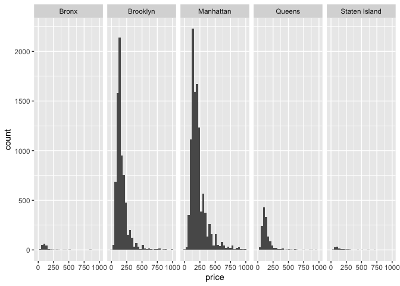
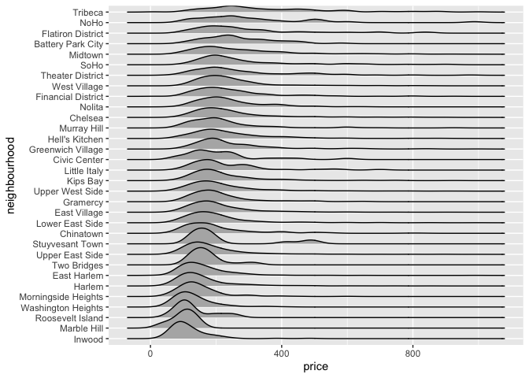

case_study
================

``` r
library(tidyverse)
```

    ## ── Attaching core tidyverse packages ──────────────────────── tidyverse 2.0.0 ──
    ## ✔ dplyr     1.1.3     ✔ readr     2.1.4
    ## ✔ forcats   1.0.0     ✔ stringr   1.5.0
    ## ✔ ggplot2   3.4.3     ✔ tibble    3.2.1
    ## ✔ lubridate 1.9.3     ✔ tidyr     1.3.0
    ## ✔ purrr     1.0.2     
    ## ── Conflicts ────────────────────────────────────────── tidyverse_conflicts() ──
    ## ✖ dplyr::filter() masks stats::filter()
    ## ✖ dplyr::lag()    masks stats::lag()
    ## ℹ Use the conflicted package (<http://conflicted.r-lib.org/>) to force all conflicts to become errors

``` r
library(tidyr)
library(dplyr)
library(ggplot2)
```

``` r
library(p8105.datasets)

data(nyc_airbnb)

nyc_airbnb = 
  nyc_airbnb |> 
  rename(borough = neighbourhood_group) |> 
  mutate(stars = review_scores_location/2)
```

``` r
nyc_airbnb |> 
  count(borough)
```

    ## # A tibble: 5 × 2
    ##   borough           n
    ##   <chr>         <int>
    ## 1 Bronx           649
    ## 2 Brooklyn      16810
    ## 3 Manhattan     19212
    ## 4 Queens         3821
    ## 5 Staten Island   261

``` r
nyc_airbnb |> 
  group_by(borough, room_type) |> 
  summarise(mean_price = mean(price)) |> 
  pivot_wider(
    names_from = room_type,
    values_from = mean_price
  )
```

    ## `summarise()` has grouped output by 'borough'. You can override using the
    ## `.groups` argument.

    ## # A tibble: 5 × 4
    ## # Groups:   borough [5]
    ##   borough       `Entire home/apt` `Private room` `Shared room`
    ##   <chr>                     <dbl>          <dbl>         <dbl>
    ## 1 Bronx                      125.           65.5          57.5
    ## 2 Brooklyn                   175.           76.7          59.6
    ## 3 Manhattan                  238.          107.           84.7
    ## 4 Queens                     140.           70.6          49.1
    ## 5 Staten Island              207.           65.4          25

``` r
nyc_airbnb |> 
  filter(price < 1000, room_type == "Entire home/apt") |> 
  ggplot(aes(x = price)) +
  geom_histogram() + 
  facet_grid(. ~ borough)
```

    ## `stat_bin()` using `bins = 30`. Pick better value with `binwidth`.

<!-- --> Since
there is so much happening within manhattan, we can take a closer look:

``` r
nyc_airbnb |> 
  filter(price < 1000, 
         room_type == "Enter home/apt",
         borough == "Manhattan") |> 
  mutate(neighbourhood = fct_reorder(neighbourhood, price)) |>  #factor reorder of neighborhood by price -- avg price of each neigh
  ggplot(aes(x = neighbourhood, y = price)) + 
  geom_boxplot()
```

<!-- -->
